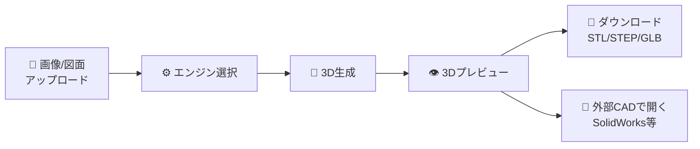

# 🏭 CAD3D Generator

[](https://github.com/jckkvs/cad2d3d)
[](https://github.com/jckkvs/cad2d3d)
[](https://python.org)
[](https://github.com/jckkvs/cad2d3d/actions)

> **2D図面や写真をアップロードするだけで、3Dモデルを自動生成する**統合プラットフォーム

---

## 🎯 こんな方に

| ユーザー | できること |
|---------|----------|
| **設計者** | 手描きスケッチ・写真・2D CAD図面(DXF/PDF)から3Dモデルを素早く作成 |
| **金型エンジニア** | 3Dモデルからアンダーカット検出・型締力計算・サイクルタイム推定を自動実行 |
| **品質管理** | 過去の図面・3Dモデルとの類似度を自動比較し、見積条件を再利用 |
| **開発者** | REST API経由で3D生成・金型計算を自社システムに組み込み |
| **研究者** | 9種類のAIエンジンの出力品質を一画面で比較 |

---

## 📥 対応ファイル形式

### 入力（アップロード可能）

| カテゴリ | 形式 |
|---------|------|
| **画像** | JPG, JPEG, PNG, BMP, TIFF, TIF, WebP, HEIC, HEIF, SVG |
| **CAD** | DXF, DWG, STEP, STP, IGES, IGS |
| **文書** | PDF |

> 💡 **手描きスケッチの写真でもOK！** スマホで撮影した手描き図面も入力できます。

### 出力（ダウンロード可能）

| 形式 | 拡張子 | 説明 |
|------|-------|------|
| **STL** | .stl | 3Dプリンタ/解析向け |
| **OBJ** | .obj | 汎用メッシュ形式 |
| **PLY** | .ply | 点群/メッシュ(色情報対応) |
| **glTF** | .gltf | Web/AR/VR向け |
| **GLB** | .glb | glTF バイナリ版(推奨) |
| **STEP** | .step | CADネイティブ(SECAD-Net) |
| **IGES** | .iges | CAD互換形式 |

### 🔧 CADソフト互換表

| CADソフト | 読み込める出力形式 | 備考 |
|----------|----------------|------|
| **SolidWorks** | STEP, IGES, STL, OBJ | STEP推奨 |
| **Fusion 360** | STEP, OBJ, STL, GLB | OBJ/GLBも直接読込可 |
| **Blender** | GLB, glTF, OBJ, PLY, STL | GLB推奨(マテリアル保持) |
| **FreeCAD** | STEP, IGES, STL, OBJ | オープンソースCAD |
| **AutoCAD** | STEP, IGES, STL | 3Dモデリング |
| **CATIA** | STEP, IGES | ハイエンドCAD |
| **NX** | STEP, IGES, STL | ハイエンドCAD |
| **3Dプリンタ** | STL | ほぼ全機種対応 |

---

## 📸 画面イメージ

起動すると、ブラウザで以下のようなインターフェースが表示されます。
ダークテーマのモダンなUIで、5つのタブから全機能にアクセスできます：

| タブ | 機能 |
|-----|------|
| **📁 入力** | 画像/CADファイルのドラッグ&ドロップアップロード、プレビュー |
| **⚙ エンジン** | 9種類の変換エンジンの一覧表示、ワンクリックで3D生成 |
| **🔀 比較** | 複数エンジンを並列実行し、生成時間・品質を比較 |
| **📦 重み** | AIモデルの重みダウンロード状況の確認・管理 |
| **🏭 金型** | アンダーカット検出・型締力計算・標準部品選定 |

右側には Three.js ベースの **3Dビューア** が常時表示され、生成結果を回転・ズームで確認できます。
「外部CADで開く」ボタンで、SolidWorks等の関連付けアプリでそのまま開くことも可能です。

---

## 🚀 導入手順

### 前提条件

| 項目 | 最低要件 | 推奨 |
|------|---------|------|
| **OS** | Windows 10 / macOS / Linux | Windows 11 |
| **Python** | 3.11 以上 | 3.13 |
| **メモリ** | 8GB | 16GB以上 |
| **GPU** | なしでも動作（フォトグラメトリ） | NVIDIA GPU (VRAM 6GB+) |
| **ディスク** | 2GB (コードのみ) | 20GB (重みファイル含む) |

> **💡 GPU がなくても使えます！**
> フォトグラメトリエンジンはCPUのみで動作します。
> GPU搭載PCでは、TripoSR/CRM等のAIエンジンも利用可能になります。

### インストール

```bash
# 1. リポジトリをクローン
git clone https://github.com/jckkvs/cad2d3d.git
cd cad2d3d/backend

# 2. パッケージをインストール（テストツール含む）
pip install -e ".[test]"

# 3. 動作確認（248件のテストが全て合格すればOK）
python -m pytest tests/ -q
# → 248 passed ✅
```

### 起動

```bash
# NiceGUI（Web UI）を起動
python nicegui_app.py
```

ブラウザで **http://127.0.0.1:8080** が自動的に開きます。

### 社内プロキシ環境での利用

企業ネットワーク内でプロキシが必要な場合は、起動後にUIの **⚙ 設定** から以下を設定してください：

```
HTTP Proxy:  http://proxy.example.com:8080
HTTPS Proxy: https://proxy.example.com:8443
```

または環境変数で設定も可能です：
```bash
set CAD3D_HTTP_PROXY=http://proxy.example.com:8080
set CAD3D_HTTPS_PROXY=https://proxy.example.com:8443
python nicegui_app.py
```

### API だけ使いたい場合

```bash
uvicorn app.main:app --host 0.0.0.0 --port 8000
# → http://localhost:8000/docs でSwagger UIが開きます
```

### バージョンアップ

```bash
cd cad2d3d
git pull origin main
cd backend
pip install -e ".[test]"
python -m pytest tests/ -q   # 動作確認
```

---

## 🔧 使い方

### 基本の流れ



1. **「入力」タブ**で画像をアップロード（ドラッグ&ドロップ対応）
2. **「エンジン」タブ**でお好みのエンジンを選択
3. **「生成」ボタン**をクリック
4. **3Dプレビュー**で結果を回転・ズームして確認
5. GLB/OBJ/STL/STEP形式で**ダウンロード**、または**「外部CADで開く」**

### エンジン比較

```
1. 「比較」タブで複数のエンジンにチェック
2. 「⚡比較生成を開始」をクリック
3. 全エンジンが並列実行され、生成時間・品質カードが一覧表示
4. 結果を見比べて最適なエンジンを選定
```

### 金型設計推定

```
1. 3Dモデルを生成（またはSTL/OBJをアップロード）
2. 「金型」タブでアンダーカット解析を実行
3. パーティングラインの最適化を確認
4. 型締力・サイクルタイム・標準部品を自動推定
```

### 類似度検索

生成した3Dモデルや図面画像と、過去のデータとの類似度を自動計算します。

- **3Dメッシュ類似度**: D2 Shape Distribution (Osada et al., 2002) による形状比較
- **2D画像類似度**: エッジ方向ヒストグラム + 輝度分布 + DNN埋め込み(オプション)

> 💡 過去の見積条件を素早く参照したい場合に便利です。

---

## ⚙ エンジン一覧

| エンジン | 入力 | 出力形式 | GPU | 速度 | おすすめ用途 |
|---------|------|---------|-----|------|------------|
| **TripoSR** | 写真1枚 | GLB/OBJ/STL | 6GB | ⚡高速 | まず試したい方 |
| **CRM** | 写真1枚 | OBJ/GLB/STL | 6GB | ⚡⚡最速 | テクスチャ付き |
| **InstantMesh** | 写真1枚 | GLB/OBJ/STL/PLY | 10GB | ⚡高速 | 品質重視 |
| **Zero123++** | 写真1枚 | OBJ/STL/GLB/PLY | 8GB | 中 | 全方位の整合性 |
| **Wonder3D** | 写真1枚 | OBJ/STL/GLB/PLY | 10GB | 中 | 法線活用で高精度 |
| **Trellis** | 写真1枚 | GLB/OBJ/STL/PLY | 12GB | 中 | Microsoft SLAT |
| **Hunyuan3D** | 写真1枚 | GLB/OBJ/STL | 16GB | 遅 | 最高解像度 |
| **フォトグラメトリ** | 写真3枚以上 | OBJ/STL/PLY | **CPU✅** | 遅 | GPU不要・実写再現 |
| **SECAD-Net** | 3Dメッシュ | **STEP**/OBJ/STL | 6GB | 中 | メッシュ→CAD変換 |

> **💡 初めての方へ**: まず **CRM** か **TripoSR** をお試しください（軽量・高速）
>
> **💡 SolidWorksで使いたい方**: **SECAD-Net** でSTEP形式に変換できます

### メッシュ品質の目安

| エンジン | 典型的な頂点数 | テクスチャ | 水密性 | 特記 |
|---------|-------------|---------|-------|------|
| TripoSR | ~50,000 | なし | ○ | 安定した品質 |
| CRM | ~30,000 | **あり** | ○ | テクスチャ付きで6秒 |
| InstantMesh | ~80,000 | なし | ○ | 高ポリゴン |
| Zero123++ | 可変 | なし | △ | SDF再構成 |
| Wonder3D | ~60,000 | なし | ○ | 法線マップ活用 |
| SECAD-Net | — | なし | ○ | B-rep CADネイティブ |
| フォトグラメトリ | 入力依存 | **あり** | △ | 写真枚数で品質向上 |

### フォトグラメトリの撮影ガイド

フォトグラメトリエンジンは複数の写真から3Dモデルを生成します：

| 項目 | 推奨値 |
|------|-------|
| **最低枚数** | 3枚（推奨: 10枚以上） |
| **撮影角度** | 対象物を中心に30°間隔で周囲から |
| **重なり** | 隣接画像間で70%以上の重なり |
| **照明** | 均一、影が少ない環境 |
| **背景** | 無地が理想（自動分離は非対応） |
| **解像度** | 高いほど精細（1920×1080以上推奨） |

> ⚠️ **必要な外部ツール**: openMVG + openMVS、または Meshroom のインストールが必要です。

---

## 🏭 金型設計機能（詳細）

3Dモデルから射出成形金型の設計パラメータを自動推定します。

### 計算モジュール一覧

| モジュール | 機能 | 計算根拠 |
|-----------|------|---------|
| **型締力計算** | 必要型締力 [kN/tf] + 推奨成形機トン数 | F = A_proj × P_cavity × N × S (Kazmer, 2007) |
| **ランナー設計** | スプルー径・ランナー径・ゲート種類 | 経験則 + 樹脂流動特性 (Rees, 2002) |
| **冷却設計** | 水管径・ピッチ・冷却時間 | Fourier非定常伝熱モデル |
| **エジェクタ設計** | ストローク・突出力・ピン数 | 摩擦力 + 残留圧力モデル |
| **鋼材選定** | コア/キャビティ鋼材・硬度・表面処理 | 生産量/樹脂/仕上げベースのルール |
| **サイクルタイム** | 射出/保持/冷却/型開閉 → 総サイクル | 重量・肉厚ベースの経験式 |
| **アンダーカット検出** | 抜き方向の干渉箇所を自動検出 | レイキャスト + クラスタリング |
| **パーティングライン** | 最適な型分割線を自動推定 | 候補方向スコアリング |
| **ドラフト角解析** | 各面の抜き勾配をカラーマップ表示 | 面法線 → 抜き方向角度計算 |

### 対応樹脂材料（10種）

PP, PE, ABS, PA(ナイロン), POM, PC, PBT, PS, PMMA, PPS

各樹脂について以下のパラメータをデータベース化：
溶融温度 / 金型温度 / 射出圧力 / 成形収縮率 / L/t比 / 原料単価

### 出力項目

| カテゴリ | 出力項目 |
|---------|---------|
| **型締力** | 投影面積, キャビティ内圧, 型締力(kN/ton), 推奨成形機(50t〜3500t) |
| **ランナー** | スプルー径, ランナー径, ゲート種類/寸法, 廃材量 |
| **冷却** | 水管径/ピッチ/深さ, 冷却時間, 推奨金型温度 |
| **エジェクタ** | ストローク, 突出力, ピン数/径, ストリッパプレート要否 |
| **鋼材** | コア/キャビティ/ベース鋼材, 硬度, 表面処理, 選定根拠 |
| **サイクル** | 射出/保持/冷却/型開閉時間, 時間あたりショット数 |

> 📐 **計算根拠**: 
> - Kazmer, D.O. "Injection Mold Design Engineering" (2007)
> - Rees, H. "Mold Engineering" (2002)
> - 各計算式は `app/mold/sizing.py` に論文引用付きで実装

---

## 📡 REST API リファレンス

起動後に `http://localhost:8000/docs` でSwagger UIが開き、全APIを試せます。

### 主要エンドポイント

| メソッド | パス | 説明 |
|---------|------|------|
| `GET` | `/api/generate/engines` | エンジン一覧 |
| `GET` | `/api/generate/engines/{name}` | エンジン詳細 |
| `GET` | `/api/generate/engines/{name}/readme` | エンジンの詳細README |
| `POST` | `/api/generate/run` | 3D生成ジョブの開始 |
| `POST` | `/api/generate/compare` | 複数エンジンを並列比較 |
| `GET` | `/api/generate/jobs/{id}` | ジョブの進捗確認 |
| `POST` | `/api/upload/` | ファイルアップロード |
| `GET` | `/api/export/download/{id}` | 結果ファイルのDL |
| `POST` | `/api/export/open-external/{id}` | 外部CADで開く |
| `POST` | `/api/mold/sizing/clamp-force` | 型締力計算 |
| `POST` | `/api/mold/sizing/cycle-time` | サイクルタイム計算 |
| `GET` | `/api/mold/parts` | 金型標準部品一覧 |
| `GET` | `/api/settings/` | 設定取得 |
| `PUT` | `/api/settings/proxy` | プロキシ設定更新 |

### APIリクエスト例

```bash
# エンジン一覧を取得
curl http://localhost:8000/api/generate/engines | python -m json.tool

# ファイルをアップロード
curl -X POST -F "files=@image.png" http://localhost:8000/api/upload/

# 型締力を計算
curl -X POST http://localhost:8000/api/mold/sizing/clamp-force \
  -H "Content-Type: application/json" \
  -d '{"projected_area_mm2": 5000, "resin": "ABS", "cavity_count": 1}'
```

---

## 🏗️ プロジェクト構成

```
cad2d3d/
├── backend/
│   ├── app/
│   │   ├── engines/          # 9種の2D→3D変換エンジン
│   │   │   ├── base.py       # ReconstructionEngine ABC
│   │   │   ├── registry.py   # プラグイン自動検出・登録
│   │   │   ├── triposr/      # TripoSR
│   │   │   ├── crm/          # CRM (テクスチャ付き)
│   │   │   ├── instantmesh/  # InstantMesh
│   │   │   ├── secadnet/     # SECAD-Net (CAD出力)
│   │   │   └── ...           # + 5エンジン
│   │   ├── api/routes/       # FastAPI エンドポイント
│   │   ├── mold/             # 金型設計(アンダーカット/PL/サイジング)
│   │   ├── preprocessing/    # 画像前処理(ビュー分割/注釈除去)
│   │   ├── postprocessing/   # メッシュ修復
│   │   ├── similarity/       # 3D/2D類似度比較
│   │   └── history/          # 生成履歴管理
│   ├── nicegui_app.py        # NiceGUI フロントエンド
│   └── tests/                # 248テスト (8ファイル)
├── .github/workflows/ci.yml  # GitHub Actions CI
├── REPRODUCEPROMPT.MD         # AI再現用 完全仕様書
└── README.md                  # ← このファイル
```

---

## ❓ トラブルシューティング

### アプリが起動しない

```bash
# ポート8080が使用中の場合
python nicegui_app.py --port 8081
```

### エンジンが「WEIGHTS_MISSING」と表示される

AIエンジンは初回利用時に重みファイルのダウンロードが必要です。
「重み」タブからダウンロードするか、以下のディレクトリに手動配置してください：

```
backend/data/weights/
├── triposr/         # TripoSR の重み
├── instantmesh/     # InstantMesh の重み
├── crm/             # CRM の重み
└── ...
```

### GPU が認識されない

```bash
# PyTorchのGPUサポートを確認
python -c "import torch; print(torch.cuda.is_available())"
# → True なら利用可能

# False の場合、CUDA対応版PyTorchを再インストール
pip install torch --index-url https://download.pytorch.org/whl/cu121
```

### プロキシ環境で重みがダウンロードできない

```bash
# 環境変数でプロキシを設定してから起動
set HTTP_PROXY=http://proxy:8080
set HTTPS_PROXY=http://proxy:8080
python nicegui_app.py
```

### テストが失敗する

```bash
# 詳細ログ付きで実行
python -m pytest tests/ -v --tb=long

# カバレッジ付き
python -m pytest tests/ --cov=app --cov-branch
```

---

## 🧪 開発者向け

### テスト実行

```bash
python -m pytest tests/ -v          # 全248テスト
python -m pytest tests/ -q          # サマリだけ
python -m pytest tests/ --cov=app   # カバレッジ付き (現在60%)
```

### CI

GitHub Actions で Python 3.11 / 3.12 / 3.13 に対してテスト+lintが自動実行されます。

### 新しいエンジンの追加

1. `app/engines/<name>/adapter.py` を作成
2. `ReconstructionEngine` を継承して必須メソッドを実装
3. ファイル末尾で `@EngineRegistry.register` デコレータを適用
4. テストを `tests/test_engines_new.py` に追加

→ 自動的にUIとAPIに表示されます（プラグインアーキテクチャ）

---

## 📄 関連ドキュメント

- [REPRODUCEPROMPT.MD](REPRODUCEPROMPT.MD) — AI再現用の完全仕様書（他のAIがこのプロジェクトを再構築するための詳細仕様）
- 各エンジンの `README_MODEL.md` — 論文引用+パイプライン説明
- `/docs` — Swagger UI（起動後にアクセス可能）

---

## 📜 ライセンス

MIT License
